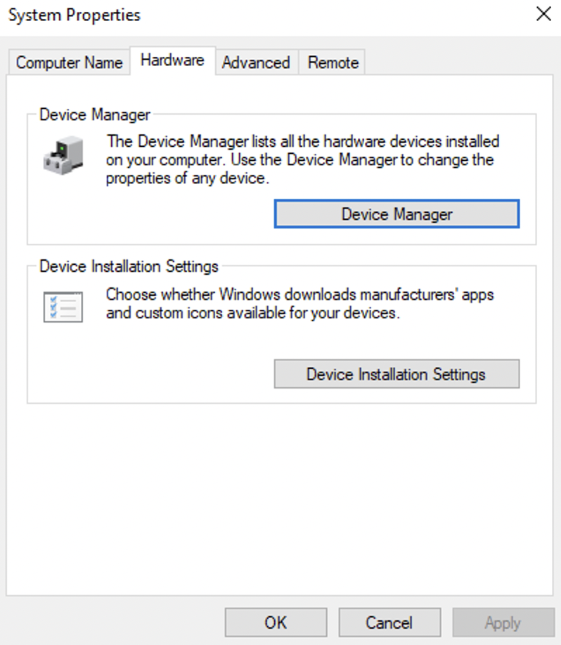

WINDOWS FUNDAMENTALS 2

SYSTEM CONFIGURATION

Moving on from Windows Fundamentals 1 to 2, it is appropriate time to introduce System Configuration (MSConfig) which is home for advanced troubleshooting, and its main purpose is to help diagnose startup issues.

Accessible through the start menu by typing out MSConfig

To open this utility, we will need local administrator rights. 

Its UI consists of five tabs:
1. General (Selecting what devices and services for Windows to load upon boot.)
2. Boot (Allows us to define various boot options for the Operating System. )
3. Services (Listing all services configured for the system regardless of their state; running or stopped)
4. Startup 
5. Tools (varying features from viewing properties, basic information, making changes to Windows registry etc.)

REMEMBER: Neither Task Manager or MSConfig will show anything in the startup tab, this is only true for Windows Server handle start up. On these server machines, only way to view startup items is through the Startup folder itself. Use Win + R and type in shell:startup to access the startup config on Windows Server. 

ADVANCED SYSTEM SETTINGS

To obtain additional configuration settings, we can search for "View advanced system settings" in the search bar, this will open the System Properties tool.

Alongside many other available features, there is a cool configuration worth mentioning from the Advanced System Setting, it is known as Startup and Recovery. Essentially windows can create a crash dump file whenever it encounters a critical error, such as Blue Screen Of Death (BSOD). This crash drump helps the admins or analysts to understand what went wrong during the crash. 

Windows supports different dump types: 

Automatic memory dump
Kernel memory dump
Small memory dump (256 KB)
Complete memory dump
None

