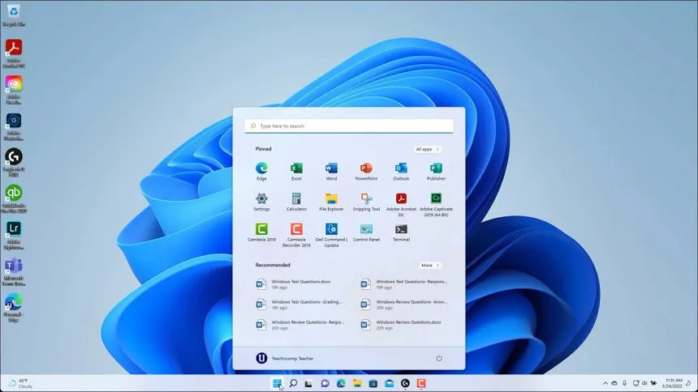
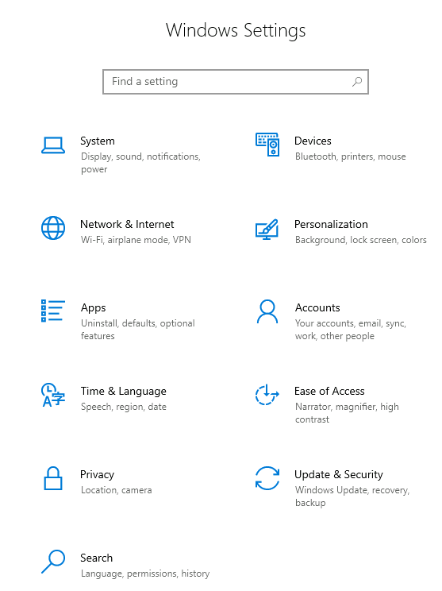
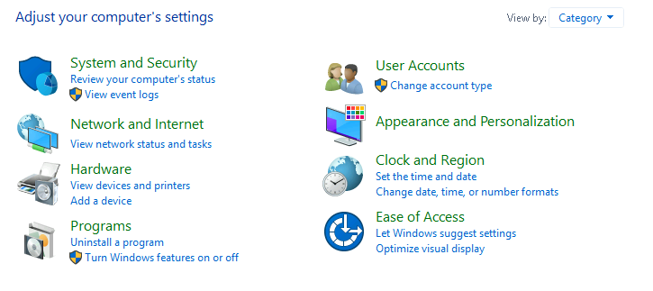

# WINDOWS FUNDAMENTALS 1

**Date:** 2026-05-23

---

## WINDOWS EDITIONS

Microsoft Windows has existed since 1985, with some notable versions being:

- **Windows 95**
- **Windows XP**
- **Windows Vista**
- **Windows 7**
- **Windows 10**
- **Windows 11**

Alongside the standard operating system, Microsoft also develops **Windows Server**, currently on version **2025**.

This is Microsoft's enterprise solution, mainly used for:

| Area | Purpose |
|---|---|
| **Centralized management** | Managing users, devices, and policies |
| **Authentication** | Handling user login and access control |
| **Networking** | Supporting services across enterprise networks |
| **Infrastructure administration** | Managing servers, services, and business systems |

One interesting feature available in **Windows 11 Pro** is **BitLocker Device Encryption**, which encrypts the drive and helps prevent unauthorized access to the system.

---

## INTRODUCTION TO WINDOWS

### Windows 11 GUI (Graphical User Interface)

Core GUI components include:

| Component | Purpose |
|---|---|
| **Start Menu** | Access applications, files, and settings |
| **Task View** | View active desktops and windows |
| **Taskbar** | Quick access to applications and features |
| **Toolbars** | Additional utility shortcuts |
| **Notification Area** | Displays system notifications and status icons |

Windows 11 is highly customizable, allowing users to personalize:

- wallpapers
- themes
- colors
- layouts

---

### The Start Menu

The **Start Menu** provides access to:

- applications
- files
- settings
- utility tools

In older Windows versions, the button contained the word **"Start"**, while modern versions only display the Windows logo.

---

### The Taskbar

The **taskbar** allows quick access to:

- running applications
- pinned applications
- system features

Features such as:

- **News & Interests**
- **Cortana**
- **Widgets**

can be enabled or disabled depending on user preference.

Personally, I prefer having most of these disabled since they can clutter the interface fairly quickly if left unmanaged.

---

### The Notification Area

Unlike the Start Menu, the **Notification Area** is located in the bottom-right corner of the screen near the system clock.

It displays:

- network connectivity
- microphone access
- audio settings
- location services
- touch keyboard
- background applications

This area can also display useful security and system notifications.

---

## THE FILE SYSTEM

Modern versions of Windows primarily use **NTFS (New Technology File System)**.

Before NTFS, Windows commonly used:

- **FAT16/FAT32** (*File Allocation Table*)
- **HPFS** (*High Performance File System*)

These older file systems can still often be found on:

- USB drives
- MicroSD cards
- older devices

---

### NTFS Improvements Over FAT

| Feature | NTFS Support |
|---|---|
| **Files larger than 4GB** | Yes |
| **File and folder compression** | Yes |
| **Encryption through EFS** | Yes |
| **Automatic repair using logs** | Yes |

One useful NTFS feature is automatic repair functionality using information stored in log files, something FAT does not support.

---

### Lesson

To check which file system a drive is using:

`Right-click drive → Properties`

---

### NTFS Permissions

---

### Lesson

To view file or folder permissions:

`Right-click → Properties → Security tab`

---

### Alternate Data Streams (ADS)

NTFS also supports **Alternate Data Streams (ADS)**.

ADS allows hidden metadata or additional data to be attached to a file without changing its main contents.

One example is:

`Zone.Identifier`

This can indicate whether a file was downloaded from the internet.

---

## THE WINDOWS/SYSTEM32 FOLDERS

The **Windows** folder contains the operating system files and is usually located on the `C:` drive by default.

The system variable for this folder is:

`%windir%`

One important subfolder is:

`System32`

This directory contains critical operating system files and utilities.

Modifying files inside this folder carelessly can make the operating system unstable or unusable.

---

## USER ACCOUNTS, PROFILES AND PERMISSIONS

A typical local Windows system mainly uses two account types:

| Account Type | Description |
|---|---|
| **Administrator** | Can modify system settings, manage users/groups, install software, and perform elevated actions |
| **Standard User** | Can perform regular day-to-day tasks, but cannot make system-level changes |

---

### Lesson

Information about local users and groups can be accessed through:

`lusrmgr.msc`

This opens **Local Users and Groups Management**.

---

## USER ACCOUNT CONTROL (UAC)

Users do not need elevated privileges for normal activities such as:

- browsing the web
- watching media
- working with documents

To reduce the risk of malware gaining full system access, Microsoft introduced **User Account Control (UAC)**.

When an administrator logs into Windows, the session does not automatically run with elevated privileges.

If an action requires higher permissions, Windows prompts the user to confirm the operation.

I had encountered this confirmation popup many times before, but never really understood what was happening behind the scenes until now.

---

## SETTINGS AND CONTROL PANEL

The two primary locations for configuring Windows are:

- **Settings**
- **Control Panel**

**Control Panel** generally contains more advanced and detailed system configuration options.

---

## TASK MANAGER

**Task Manager** provides information about:

- running applications
- processes
- system performance

It also displays:

| Resource | What It Shows |
|---|---|
| **CPU** | Processor usage |
| **RAM** | Memory usage |
| **Disk** | Disk activity |
| **Network** | Network utilization |

Task Manager can be opened quickly by right-clicking the taskbar.

---

## TAKEAWAY

Even though Windows has been my primary operating system for many years, this room still managed to humble me a bit.

Most of the concepts covered here were already somewhat familiar to me, but it was still a useful refresher and a reminder that understanding the basics properly matters, especially when approaching cybersecurity and system administration.
